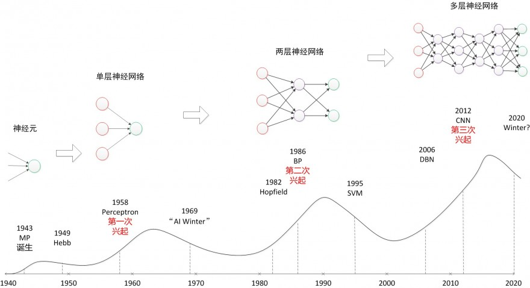
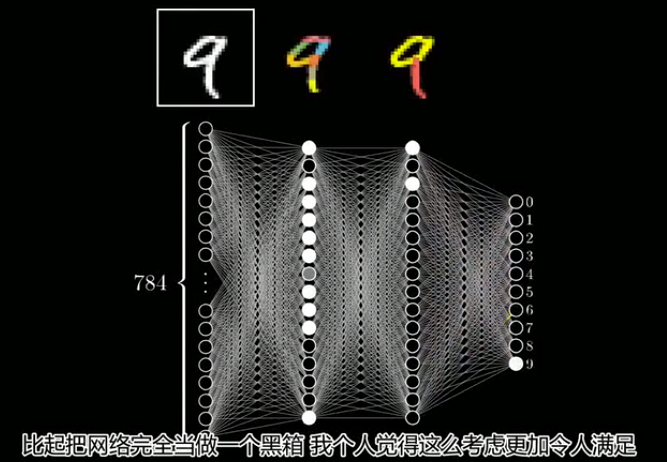
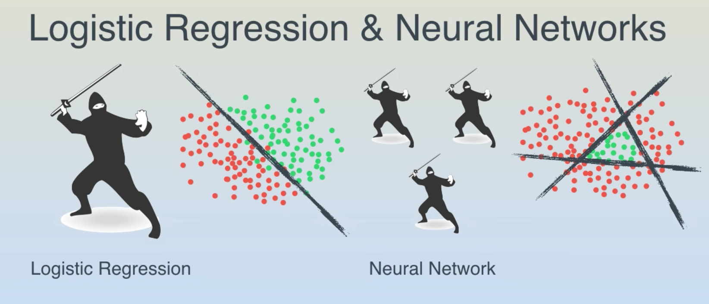
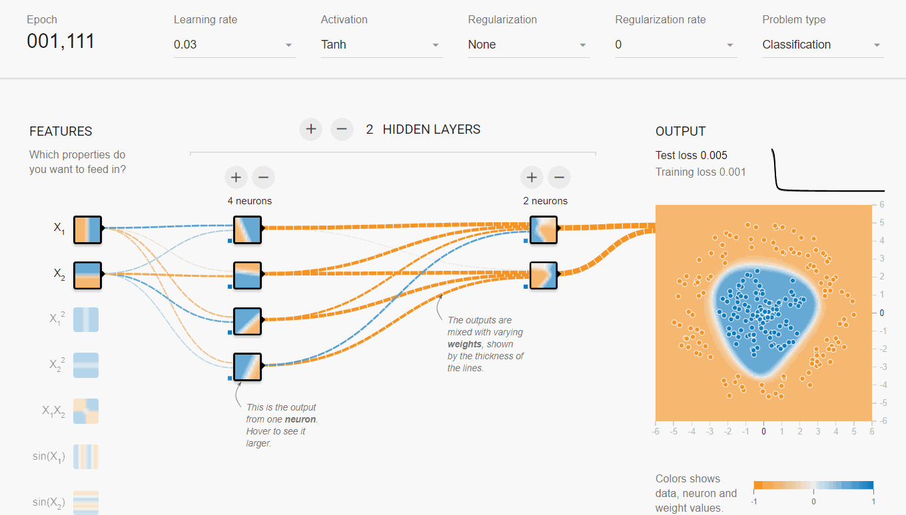

# 闲话神经网络

* content
{:toc}

>编者按： 平时收集了不少神经网络知识片段，过于零散，花了大半天时间将各种细节梳理，串联起来。

总结：

这一篇杂文，把之前收集的神经网络点点滴滴，梳理、串联起来，便于理解，如有不当，麻烦及时指出，邮箱：wqw547243068@163.com。

# 神经网络发展历史

先看看这几张图：

神经网络三次兴起：
- 第一次，`控制论`时代，1958年，感知器诞生，能分类，但解决不了异或问题；
- 第二次，`联结主义`时代，BP网络诞生，加非线性激活函数，解决了异或，但受限于理论不完善（局部最优，黑盒）+数据少+训练方法+计算能力，败于SVM与概率图；
- 第三次，2006年，祖师爷Goeffrey Hinton坐了几十年冷板凳，琢磨出pre-training，DBN等，接着一发不可收拾。Yann LeCun将CNN发扬光大（将BP与CNN结合，推出第一个可用的Le-Net，深度学习入门者的hello world），Jürgen Schmidhuber 90年代发明的LSTM，沉寂多年后复活了，Yoshua Bengio开创了神经网络语言模型。加上大数据时代，GPU的发展等，诸多因素导致深度学习“大爆炸”。
> 注：这里不做过多介绍，详情参考，[「Deep Learning」读书系列分享（一）](https://www.leiphone.com/news/201708/LEBNjZzvm0Q3Ipp0.html)

# 神经网络基础回顾

左边是一个生物学的神经元，右边是一个常用的数学模型。

人工神经网络中的神经元设计受到生物神经元的启发。

总结要点：
- 生物神经元（左图）中，树突将信号传递到细胞体，信号在细胞体中相加。如果和高于某个阈值，那么神经元将会激活，向其轴突输出一个峰值信号，注意是一个脉冲信号。
- 数学计算模型（右图）中，将输入进行加权求和加上偏置，输入到激活函数（模拟生物中神经元）中，继续往后传递。
- 需要注意：生物中神经元复杂得多，其一，输出是一个脉冲，而不是一个值，现在也有脉冲人工神经网络（号称第三代神经网络）。

多个神经元组合起来，`输入层`，`隐含层`和`输出层`，组成神经网络。常见的是`前馈神经网络`，典型例子`多层感知器`，变种是`循环神经网络`（时间上共享）和`卷积神经网络`（空间上共享）等。
- 当然，80-90年代，还有诞生过其他结构的网络，如
   - `反馈神经网络`（输出与输入直接关联，如Elman网络和Hopfield网络）
   - `自组织神经网络`（无监督，每次竞争，只更新一个神经元，参数和网络结构自适应）
   - `模糊神经网络`
   - `径向基神经网络`（跟早期的BP网络同步）
- 等等，只是应用效果欠佳，逐渐淹没在时代潮流里，被人遗忘。

参考：[神经网络用作分类器](https://www.cnblogs.com/babyfei/p/7003299.html)

# 十万个为什么

神经网络从名不见经传到现在大红大紫，成了AI浪潮的主力。只要跟AI相关，基本都要扯上神经网络，从多层感知器`MLP`，到卷积神经网络`CNN`，循环神经网络`RNN`，再到自编码器`AE`，变分自编码`VAE`，生成对抗网络`GAN`，一个又一个，让人应接不暇。

身处信息爆炸时代的初学者，如果人云亦云，没有自己的思考，很容易陷入懵逼状态：
- 神经网络到底是什么“神经”物种？神经元？人类大脑？
   - 外行一听，觉得高端大气上档次，却又遥不可及，只得双手合十，顶礼膜拜，不可理解推敲焉，只好找个佛龛供起来，一方面自己有了信仰，心里不慌，另一方面又能“吓唬”别人，^_^。
- 神经网络怎么工作的？为什么具备这么强的拟合能力？
   - 以第二代神经网络MLP（含BP机制，第一代是感知器，第二代是BP网络，第三代是脉冲神经网络）为例，结构并不复杂：输入层，隐含层和输出层，训练期间，根据预设的目标通过BP反向传播机制学习出一组隐含层参数。
   - 万能近似定理说为我们提供了坚实的神经网络理论保障。
      - 万能近似定理（universal approximation theorem）(Hornik et al., 1989;Cybenko, 1989) 表明，一个前馈神经网络如果具有线性输出层和至少一层具有任何一种“挤压”性质的激活函数（例如logistic sigmoid激活函数）的隐藏层，只要给予网络足够数量的隐藏单元，就能以任意精度来近似任何从一个有限维空间到另一个有限维空间的Borel可测函数（定义在紧集上的连续函数）。（《Deep learning》[英文版](https://www.deeplearningbook.org/contents/mlp.html)P194，中文版P171）
带着这些问题，我们接着往下走
> 注：如果对神经网络工作原理缺乏了解，但想在30min内有个基本轮廓，建议看完以下视频：
- [3Blue1Brown科普:什么是神经网络？](https://www.bilibili.com/video/av33138973/?spm_id_from=333.788.videocard.7)
   - <iframe src="//player.bilibili.com/player.html?aid=33138973&cid=58003723&page=1" scrolling="no" border="0" frameborder="no" framespacing="0" allowfullscreen="true"  height="600" width="100%"> </iframe>
- 相关视频：《线性代数本质》、《微积分》等
- 三棕一蓝很优秀，很无私，赞一个！

## 隐含层有什么用？

### 对隐含层的感性认知

神经网络给大家留下了深刻的印象，但是总让人琢磨不透。权重和偏置量能自动地学习得到，但是这并不意味着能解释神经网络是怎么样得出的这些参数。现在仍然没人说清楚为什么某某节点的权重参数为什么取值为某个值。

所以，第二次寒潮被人批评的槽点至今还在：神经网络模型是个黑盒子，凭什么让我信任？o(╯□╰)o。

这个“黑盒子”，主要是指隐含层，光看名字就有种神秘感，隐形人，神秘人

作为好奇心爆棚的人类，有想过，隐含层到底在做什么吗？

从一个问题开始，如何区分以下三张图哪个是人？

这个人脸识别任务中，神经网络模型该怎么建立？简单起见，图像里所有像素作为输入，输出是是或否的标签。

那么隐含层怎么分析呢？ 如果是人，我们会试着将这个问题分解为一些列的子问题

比如：
- 在上方有头发吗？
- 在左上、右上各有一个眼睛吗？
- 在中间有鼻子吗？
- 在下方中间位置有嘴巴吗？
- 在左、右两侧有耳朵吗？
- ...

识别眼睛这个子任务，可能对应一个子网络：

这个子网络还可以进一步分解，一层又一层地分解，直到能由一个神经元给出结果。

这么说，隐含层承担的角色是子任务的识别、组合，从一系列简单、具体得问题开始，建立更复杂、抽象的概念。

### 隐含层的理性认知

刚才是从人的感性角度来理解，这次换成无感情的物理角度。([神经网络隐含层的物理含义](https://blog.csdn.net/qq_22690765/article/details/75050943))

多层神经网络，将原始输入数据在隐含层上做了多个二分类，隐含层有多少个神经元，就有多少个分类。

> 注：源自Youtube上的一个优秀的教学视频：[A Friendly Introduction to Machine Learning](https://www.youtube.com/watch?v=IpGxLWOIZy4)

假设在平板上玩改版的水果忍者，同时飞过来一堆圣女果和葡萄，怎么分开？
- 如果刚好线性可分，那么轻松划一刀就好了。
- 如果葡萄都聚集在中间三角区的呢？这时就以迅雷不及掩耳之势，连砍三刀，K.O.
等等，这游戏跟神经网络什么关系？

水果在平板上的坐标就是输入数据，维度是2，即x1和x2，线性可分，一个分类器就行；线性不可分的三角形区域，就得综合3个二分类器的结果，即y1、y2和y3围成的区域。其实，这就是有3个神经元的隐含层。细心的话，会发现，你砍的每一刀（每个神经元）就是一个LR回归（自行脑补LR数学表达式）

对于高维数据，不清楚分类面长啥样，隐含层的层数以及每层中神经元的个数，只能通过多次训练调整。

这就是为什么多层神经网络有多个隐含层。

AI圣经《Deep Learning》中有一部分解释的很清楚，隐含层的意义就是让线性不可分的数据变得线性可分：

- 高维空间上的数据就像一张白纸上的两类点，分类面奇奇怪怪。对着足够多次后，总能找到近似平行的线段 
- 每个线段附近的分类任务对应一个神经元
- 每次折叠对应一个隐含层
- 要点：深层网络的表示能力具备指数级优势

注：《deep learning》中文版第6章P124，以上是个人理解，不一定正确
既然隐含层这么重要，是不是越多越好呢？
有更多神经元的神经网络可以表达更复杂的函数。然而这既是优势也是不足，优势是可以分类更复杂的数据，不足是可能造成对训练数据的过拟合。

> 注：过拟合（Overfitting）是网络对数据中的噪声有很强的拟合能力，而没有重视数据间（假设）的潜在基本关系。举例来说，有20个神经元隐层的网络拟合了所有的训练数据，但代价是把决策边界变成了许多不相连的红绿区域。而有3个神经元的模型表达能力只能用比较宽泛的方式去分类。它将数据看做是两个大块，并把个别在绿色区域内的红色点看做噪声。实际上，在测试数据中会获得更好的泛化（generalization）能力。

反过来，如果数据不是足够复杂，似乎小一点的网络更好，可以防止过拟合。然而并非如此，防止神经网络的过拟合有很多方法（L2正则化，dropout和输入噪音等），后面会详细讨论。在实践中，使用这些方法来控制过拟合比减少网络神经元数目要好得多。

原因是小网络更难使用梯度下降等局部方法来进行训练：虽然小型网络的损失函数的局部极小值更少，也比较容易收敛到这些局部极小值，但是这些最小值一般都很差，损失值很高。相反，大网络拥有更多的局部极小值，但就实际损失值来看，这些局部极小值表现更好，损失更小。因为神经网络是非凸的，就很难从数学上研究这些特性。即便如此，还是有一些文章尝试对这些目标函数进行理解，例如The Loss Surfaces of Multilayer Networks 这篇论文。在实际中，你将发现如果训练的是一个小网络，那么最终的损失值将展现出多变性：某些情况下运气好会收敛到一个好的地方，某些情况下就收敛到一个不好的极值。从另一方面来说，如果训练一个大的网络，你将发现许多不同的解决方法，但是最终损失值的差异将会小很多。所有的解决办法都差不多，而且对于随机初始化参数好坏的依赖也会小很多。
正则化强度是控制神经网络过拟合的好方法。看下图结果：

（不同正则化强度的效果：每个神经网络都有20个隐层神经元，但是随着正则化强度增加，它的决策边界变得更加平滑。）

需要记住的是：不应该因为害怕出现过拟合而使用小网络。相反，应该进尽可能使用大网络，然后使用正则化技巧来控制过拟合。

参考：[神经网络七：神经网络设置层的数量和尺寸](https://blog.csdn.net/Bixiwen_liu/article/details/52954056)

## 光说不练假把式
学习金字塔有云：阅读演示的留存率不到30%，实践的留存是75%。

看完这篇文章一段时间后大部分都会忘记，为了加深印象，我们来“实践”吧！建议大家消化理解后做笔记，用费曼技巧（参考：[号称终极快速学习法的费曼技巧，究竟是什么样的学习方法？](https://www.zhihu.com/question/20576786)）讲给别人听，这不是浪费时间，看好了，留存率90%！

### 案例一: 动图显示神经网络各层之间的效果
Andrej karparthy的[ConvNetJS](https://cs.stanford.edu/people/karpathy/convnetjs/) web页面上有很多很好的交互demo，如mnist、CFAIR-10的降维可视化、自编码器
- [ConvnetJS](https://cs.stanford.edu/people/karpathy/convnetjs/) demo: [toy 2d classification with 2-layer neural network](https://cs.stanford.edu/people/karpathy/convnetjs/demo/classify2d.html)
直接构建3层的神经网络：
- fc(6) → tanh(6) → fc(4) → tanh(4) → fc(2) → tanh(2) → softmax(2)
仔细看以下动图：
- 左侧的数据集样例，这里默认选用球形数据集，分成两类：绿色和红色，支持人工编辑
- 右侧是神经网络各层学习到的分类面
分析：越往后，分类面越简洁、清晰（低维线性不可分映射到高维空间，使其线性可分）

### 案例二： Playground

[Playground](http://playground.tensorflow.org/#activation=tanh&batchSize=10&dataset=circle&regDataset=reg-plane&learningRate=0.03&regularizationRate=0&noise=0&networkShape=4,2&seed=0.45786&showTestData=false&discretize=false&percTrainData=50&x=true&y=true&xTimesY=false&xSquared=false&ySquared=false&cosX=false&sinX=false&cosY=false&sinY=false&collectStats=false&problem=classification&initZero=false&hideText=false)这个网页提供了更详细的神经网络交互体验功能，用户可以更灵活的控制神经网络结构，还能看到训练过程中各层分类面的样子。
- 同样选取球形数据集，蓝色和橙色两类，不可编辑；可设置噪声比例，测试集比例，以及batch size大小
- MLP网络结构：可随意指定输入特征、网络深度、宽度，以及激活函数类型

动图：

分析：
- 第一个隐含层只是完成简单的二分类，第二个隐含层将前面的分类面组合起来，形成复杂的分类面，最终在输出层将两类数据完美的分开。
- 隐含层越宽、越深，学习能力（网络容量）越强，收敛速度越快
- 其他问题，建议自行体验：
   - 不同激活函数会影响收敛速度吗？
   - 加入交叉特征，收敛会更快吗？
   - 网络越深/宽越好吗？
   - 深度和宽度，哪个更重要？

## 到底应该多少个隐含层

[神经网络中隐层数和隐层节点数问题的讨论](https://blog.csdn.net/kingzone_2008/article/details/81291507)

一 隐层数

> 一般认为，增加隐层数可以降低网络误差（也有文献认为不一定能有效降低），提高精度，但也使网络复杂化，从而增加了网络的训练时间和出现“过拟合”的倾向。一般神经网络应优先考虑3层网络（即有1个隐层）。靠增加隐层节点数来获得较低的误差，代价要比增加隐层数更小。对于没有隐层的神经网络模型，实际上就是一个线性或非线性（取决于输出层采用线性或非线性转换函数型式）回归模型。

二  隐层节点数

在BP 网络中，隐层节点数的选择非常重要，不仅对建立的神经网络模型的性能影响很大，还是“过拟合”的直接原因，但目前理论上还没有一种科学的和普遍的确定方法。 多数文献中提出的确定隐层节点数的计算公式都是针对训练样本任意多的情况，而且多数是针对最不利的情况，一般工程实践中很难满足，不宜采用。事实上，各种计算公式得到的隐层节点数有时相差几倍甚至上百倍。为了尽可能避免训练时出现“过拟合”现象，保证足够高的网络性能和泛化能力，确定隐层节点数的最基本原则是：在满足精度要求的前提下取尽可能紧凑的结构，即取尽可能少的隐层节点数。

研究表明，隐层节点数不仅与输入/输出层的节点数有关，更与需解决的问题复杂程度和转换函数的型式以及样本数据的特性等因素有关。

在确定隐层节点数时必须满足下列条件：
- （1）隐层节点数必须小于N-1（其中N为训练样本数，不是特征数！），否则，网络模型的系统误差与训练样本的特性无关而趋于零，即建立的网络模型没有泛化能力，也没有任何实用价值。同理可推得：输入层的节点数（变量数）必须小于N-1。
- (2) 训练样本数必须多于网络模型的连接权数，一般为2~10倍，否则，样本必须分成几部分并采用“轮流训练”的方法才可能得到可靠的神经网络模型。 

总之，若隐层节点数太少，网络可能根本不能训练或网络性能很差；若隐层节点数太多，虽然可使网络的系统误差减小，但一方面使网络训练时间延长，另一方面，训练容易陷入局部极小点而得不到最优点，也是训练时出现“过拟合”的内在原因。因此，合理隐层节点数应在综合考虑网络结构复杂程度和误差大小的情况下用节点删除法和扩张法确定。

### 到底多少神经元？

当训练集确定之后，输入层结点数和输出层结点数随之而确定，首先遇到的一个十分重要而又困难的问题是如何优化隐层结点数和隐层数。实验表明，如果隐层结点数过少，网络不能具有必要的学习能力和信息处理能力。反之，若过多，不仅会大大增加网络结构的复杂性（这一点对硬件实现的网络尤其重要），网络在学习过程中更易陷入局部极小点，而且会使网络的学习速度变得很慢。隐层结点数的选择问题一直受到高度重视。
- 方法1： fangfaGorman指出隐层结点数s与模式数N的关系是：s＝log2N；
- 方法2： Kolmogorov定理表明，隐层结点数s＝2n＋1（n为输入层结点数）；
- 方法3： s＝sqrt（0.43mn＋0.12nn＋2.54m＋0.77n＋0.35）＋0.51 
- （m是输入层的个数，n是输出层的个数）。

## 隐含层越胖越好？
保证准确率的前提下隐藏层节点数最少可以是多少个？

《[神经网络隐藏层节点数最少可以是多少个？](https://blog.csdn.net/georgesale/article/details/80248884)》搭建了一个81*n*2的神经网络，通过改变n的值测量这个网络隐藏层节点数量的极小值。

实验：
- 训练集和测试集是mnist的0和1，经过1/3的池化变成9*9的图片，每个n值进行200批，每10批测量一次准确率。
- 每批的batchsize是20个用放回取样，每批迭代1000次。
- 学习率是0.1，没有偏置，激活函数用sigmoid，并同时统计每批次的运行时间。

对于这个81*n*2的网络的隐藏层节点数最小值可以是2，还是挺令人震惊的的，也就是81*2*2的网络就可以运行准确率可以达到93%，和81*50*2的网络的性能差不多，但是时间只有81*50*2的0.076，也就是说用81*2*2的网络比81*50*2的网络可以省下92%的时间。

一个非常明显的规律：当隐藏层节点数大于20个以后，平均每节点耗时大约都是16.44ms左右的定值，也就是说当节点数大于20个以后网络的耗时基本上可以按照 耗时=nX16.44 的公式算出来。但是网络的性能确没有增加。

按照耗时曲线找到拐点附近的点，就是用时最少同时性能也有保证的隐藏层节点数量。比如这道题就是20个节点左右耗时曲线的第5个点。

## 更宽还是更胖？Wider or deeper？

有两个以上隐含层的神经网络，称为深度神经网络，deep neural networks，简称为 DNN。

对很多现实问题，深层网络比浅层网络效果更好，原因是深度神经网络建立了更加复杂的体系结构，结果更理想。

那么，传统机器学习方法中就没有这种意识吗？就没有层次结构吗？

当然有，如决策树，不断的加深层次，分裂特征区间，但为什么效果没有DNN好呢？

原因是：决策树方法的仅限于特征间的筛选，模型本身也不复杂，表示能力不如DNN

综上，深度学习算法跟传统机器学习算法相比，要点在于：
- 第一，逐层处理
- 第二，特征内部变化
- 第三，足够的模型复杂度
注：摘自周志华2018年4月16日的演讲，[深度学习为什么深？](https://yq.aliyun.com/articles/581994)

回到正题，对神经网络这样的模型来说有两条很明显的途径，一条是我们把模型变深，一条是我们把它变宽，但是如果从提升复杂度的角度，变深会更有效。变宽时只不过增加了一些计算单元、增加了函数的个数，而在变深时不仅增加了个数，其实还增加了嵌入的层次，所以泛函的表达能力会更强。有点类似乘法（层间）与加法（层内）的区别。
但是，刚才不是说两层前馈网络能拟合任意精度的函数吗？我就不信胖子就不行！

怀疑的好，来看下李宏毅的提供的实验：
同样的隐含层神经元数目，一种矮胖，一种瘦高

语音识别任务下的对比，采用字错误率。

虽然有研究表明，浅而肥的网络也可以拟合任何的函数，但需要非常的“肥胖”，可能一层就要成千上万个神经元，直接导致参数的数量增加到很多很多。当准确率差不多的时候，参数的数量却相差数倍。这也说明用深层神经网络而不是浅层“肥胖”网络。

附：2018年2月，Google tensorflow dev submmit的解答：
- Why deeper models？
   - One explanation：multi-level feature abstraction 
   - Each layer is a relatively simple model
   - Each layer generally loses some information due to the use of nonlinear functions——so it needs to remember something good

# 神经网络可解释性

上面只是简答的示例，有更复杂的案例吗？
[The Building Blocks of Interpretability](https://distill.pub/2018/building-blocks/)（交互地址）
[2分钟论文 | 用 谷歌「AI可解释性」 看懂机器学习](https://www.toutiao.com/a6534574654458167815/?tt_from=mobile_qq&utm_campaign=client_share&timestamp=1521592137&app=news_article&utm_source=mobile_qq&iid=28217844450&utm_medium=toutiao_android)

神经网络可解释性仍然是一个模糊地带，没有达成共识。

